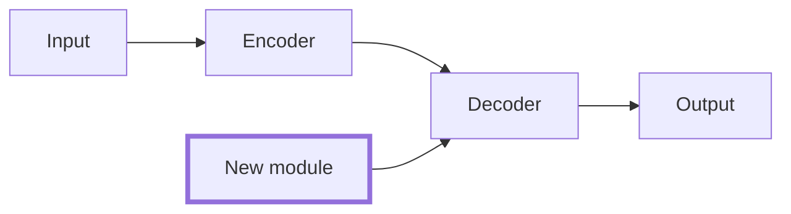

# 〔題目〕實驗設計 v〔1〕 〔YYYY-MM-DD〕

> 複製成 `〔題目〕_design_〔日期〕.md` 再填。怎麼填見 Lab-Hub 第 2 站 `guides/experiment_design/design_table1.md`。
> 檔尾「審核紀錄」沒有教授的一行之前，不要開始寫程式。

## 一句話主張
在〔任務〕上，〔baseline〕加上〔我的一格〕之後，〔主指標〕在〔資料集〕上改善〔幅度〕，代價是〔　〕。

## 貢獻類型
〔新成分／新架構／新學習方式／新損失函數〕；動的那一格是：〔　〕

## Table 1（空表；格子填來源代碼 C 引用／R 復現／O 自己跑／— 不跑）
Table 1: 〔一句話說這張表在比什麼〕

| Method | Params | 〔Dataset A〕 〔metric〕 | 〔Dataset A〕 〔metric 2〕 | 〔Dataset B〕 〔metric〕 | 〔Dataset B〕 〔metric 2〕 |
|---|---|---|---|---|---|
| 〔簡單 baseline〕 | | O | O | O | O |
| 〔必備 baseline〕 | | R | R | R | R |
| 〔最強公開 baseline〕 | | C 或 R | | | |
| Ours | | O | O | O | O |

## 消融表（空表）
Table 2: Ablation on 〔Dataset A〕

| Variant | 〔metric〕 | 〔metric 2〕 |
|---|---|---|
| Ours (full) | O | O |
| − 〔成分 1〕 | O | O |
| − 全部新成分（＝必備 baseline） | R | R |

## Method figure

## Baseline
| 名稱 | 層 | 實作來源（repo） | 來源代碼 | 選入理由 |
|---|---|---|---|---|

## 資料集
| 名稱 | 層 | 版本／切分 | 用途 | 選入理由 |
|---|---|---|---|---|

## 公平比較
backbone：〔　〕 訓練資料：〔　〕 算力預算：〔　〕 解碼：〔　〕 seed 數：〔和教授討論後填〕 顯著性：〔　〕

## 長論文預留
分析維度：〔　〕 代價表：〔Params／RTF〕 預期失敗情境：〔　〕

## Pilot
內容：〔　〕 成立判準：〔　〕 放棄判準：〔　〕 預計完成：〔日期〕

## 空格說明
〔Table 1 裡每個 — 的理由〕

## 要問教授的事與答案
| 問題 | 答案 | 日期 |
|---|---|---|

## 審核紀錄
| 日期 | 版本 | 場合 | 結論 |
|---|---|---|---|
| | v1 | group meeting | 〔通過／修改後再報／退回 1b〕 |
